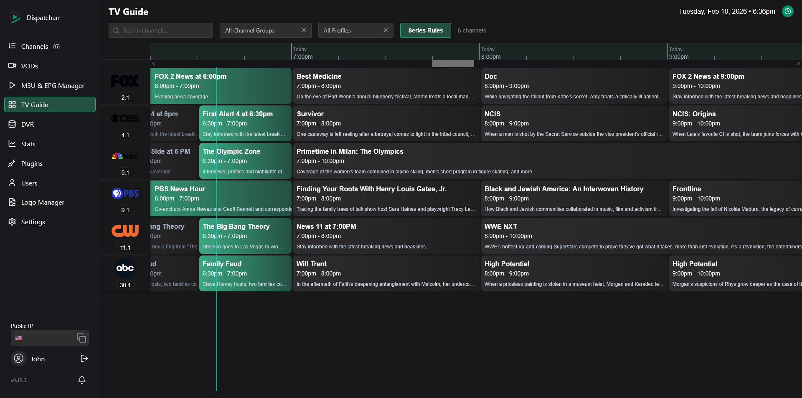
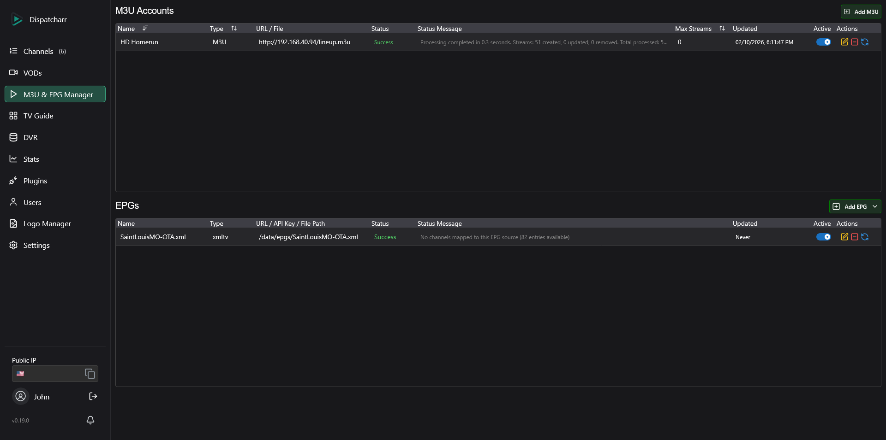
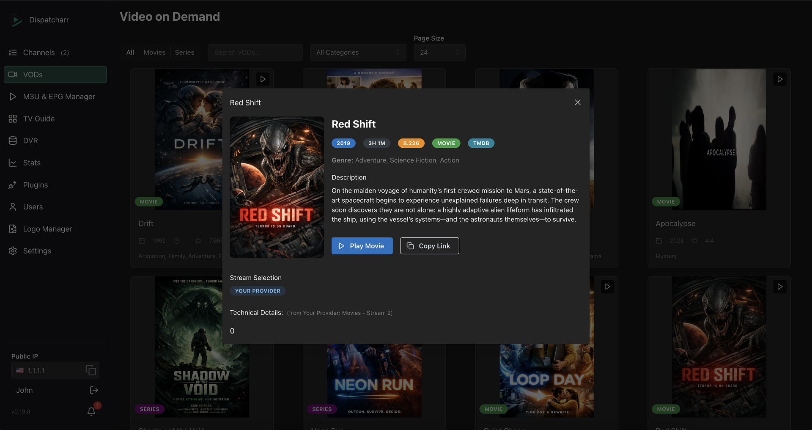
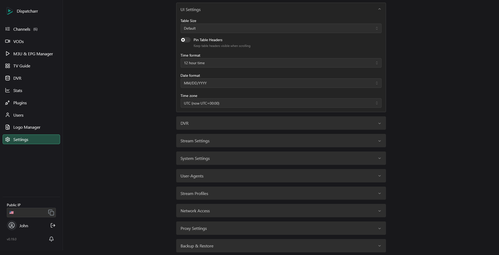

# 🎬 Dispatcharr — Your Ultimate IPTV & Stream Management Companion

<p align="center">
  
</p>

---

## 📖 What is Dispatcharr?

Dispatcharr (pronounced like "dispatcher") is an **open-source powerhouse** for managing IPTV streams, EPG data, and VOD content with elegance and control.\
Born from necessity and built with passion, it started as a personal project by **[OkinawaBoss](https://github.com/OkinawaBoss)** and evolved with contributions from legends like **[dekzter](https://github.com/dekzter)**, **[SergeantPanda](https://github.com/SergeantPanda)** and **Bucatini**.

> Think of Dispatcharr as the \*arr family's IPTV cousin — simple, smart, and designed for streamers who want reliability and flexibility.

---

## 🎯 What Can I Do With Dispatcharr?

Dispatcharr empowers you with complete IPTV control. Here are some real-world scenarios:

💡 **Consolidate Multiple IPTV Sources**\
Combine streams from multiple providers into a single interface. Manage, filter, and organize thousands of channels with ease.

📺 **Integrate with Media Centers**\
Use HDHomeRun emulation to add virtual tuners to **Plex**, **Emby**, or **Jellyfin**. They'll discover Dispatcharr as a live TV source and can record programs directly to their own DVR libraries.

📡 **Create a Personal TV Ecosystem**\
Merge live TV channels with custom EPG guides. Generate XMLTV schedules or use auto-matching to align channels with existing program data. Export as M3U, Xtream Codes API, or HDHomeRun device.

🔧 **Transcode & Optimize Streams**\
Configure output profiles with FFmpeg transcoding to optimize streams for different clients — reduce bandwidth, standardize formats, or add audio normalization.

🔐 **Centralize VPN Access**\
Run Dispatcharr through a VPN container (like Gluetun) so all streams route through a single VPN connection. Your clients access geo-blocked content without needing individual VPNs, reducing bandwidth overhead and simplifying network management.

🚀 **Monitor & Manage in Real-Time**\
Track active streams, client connections, and bandwidth usage with live statistics. Monitor buffering events and stream quality. Automatic failover keeps viewers connected when streams fail—seamlessly switching to backup sources without interruption.

👥 **Share Access Safely**\
Create multiple user accounts with granular permissions. Share streams via M3U playlists or Xtream Codes API while controlling which users access which channels, profiles, or features. Network-based access restrictions available for additional security.

🔌 **Extend with Plugins**\
Build custom integrations using Dispatcharr's robust plugin system. Automate tasks, connect to external services, or add entirely new workflows.

---

## ✨ Why You'll Love Dispatcharr

✅ **Stream Proxy & Relay** — Intercept and proxy IPTV streams with real-time client management\
✅ **M3U & Xtream Codes** — Import, filter, and organize playlists with multiple backend support\
✅ **EPG Matching & Generation** — Auto-match EPG to channels or generate custom TV guides\
✅ **Video on Demand** — Stream movies and TV series with rich metadata and IMDB/TMDB integration\
✅ **Multi-Format Output** — Export as M3U, XMLTV EPG, Xtream Codes API, or HDHomeRun device\
✅ **Real-Time Monitoring** — Live connection stats, bandwidth tracking, and automatic failover\
✅ **Stream Profiles** — Configure different stream profiles for various clients and bandwidth requirements\
✅ **Flexible Streaming Backends** — VLC, FFmpeg, Streamlink, or custom backends for transcoding and streaming\
✅ **Multi-User & Access Control** — Granular permissions and network-based access restrictions\
✅ **Plugin System** — Extend functionality with custom plugins for automation and integrations\
✅ **Fully Self-Hosted** — Total control, no third-party dependencies

---

# Screenshots

<div align="center">
  
  
  
  
  
  
</div>

---

## 🛠️ Troubleshooting & Help

- **General help?** Visit [Dispatcharr Docs](https://dispatcharr.github.io/Dispatcharr-Docs/)
- **Community support?** Join our [Discord](https://discord.gg/Sp45V5BcxU)

---

## 🚀 Get Started in Minutes

### 🐳 Quick Start with Docker (Recommended)

```bash
docker pull ghcr.io/dispatcharr/dispatcharr:latest
docker run -d \
  -p 9191:9191 \
  --name dispatcharr \
  -v dispatcharr_data:/data \
  ghcr.io/dispatcharr/dispatcharr:latest
```

> Customize ports and volumes to fit your setup.

---

### 🐋 Docker Compose Options

| Use Case                    | File                                                    | Description                                                                                                   |
| --------------------------- | ------------------------------------------------------- | ------------------------------------------------------------------------------------------------------------- |
| **All-in-One Deployment**   | [docker-compose.aio.yml](docker/docker-compose.aio.yml) | ⭐ Recommended! A simple, all-in-one solution — everything runs in a single container for quick setup.        |
| **Modular Deployment**      | [docker-compose.yml](docker/docker-compose.yml)         | Separate containers for Dispatcharr, Celery, Redis, and Postgres — perfect if you want more granular control. |
| **Development Environment** | [docker-compose.dev.yml](docker/docker-compose.dev.yml) | Developer-friendly setup with pre-configured ports and settings for contributing and testing.                 |

---

### 🛠️ Building from Source

> ⚠️ **Warning**: Not officially supported — but if you're here, you know what you're doing!

If you are running a Debian-based OS, use the `debian_install.sh` script. For other OS, contribute a script and we’ll add it!

---

## 🤝 Want to Contribute?

We welcome **PRs, issues, ideas, and suggestions**!

- Prior to contributing, please read the [CONTRIBUTING.md](https://github.com/Dispatcharr/Dispatcharr/blob/main/CONTRIBUTING.md)

> Whether it's writing docs, squashing bugs, or building new features, your contribution matters! 🙋

---

## 📚 Documentation & Roadmap

- 📖 **Documentation:** [Dispatcharr Docs](https://dispatcharr.github.io/Dispatcharr-Docs/)

**Upcoming Features (in no particular order):**

- 🎬 **VOD Management Enhancements** — Granular metadata control and cleanup of unwanted VOD content
- 📁 **Media Library** — Import local files and serve them over XC API
- 👥 **Enhanced User Management** — Customizable XC API output per user account
- 🔄 **Output Stream Profiles** — Different clients with different stream profiles (bandwidth control, quality tiers)
- 🔌 **Fallback Videos** — Automatic fallback content when channels are unavailable

---

## ❤️ Shoutouts

A huge thank you to all the incredible open-source projects and libraries that power Dispatcharr. We stand on the shoulders of giants!

---

## ✉️ Connect With Us

Have a question? Want to suggest a feature? Just want to say hi?\
➡️ **[Open an issue](https://github.com/Dispatcharr/Dispatcharr/issues)** or reach out on [Discord](https://discord.gg/Sp45V5BcxU).

---

## 💖 Support Dispatcharr

[](https://opencollective.com/dispatcharr/contribute)

Open Collective provides a transparent way for anyone who finds value in Dispatcharr to support things like:
• Infrastructure costs (Domains, Servers, etc.)
• Apple Developer Program and Google Play Developer accounts
• Helping contributors dedicate more time to improving the project

Support is completely optional, and Dispatcharr will always remain free and open-source.

[Contribute here](https://opencollective.com/dispatcharr/contribute)

---

## ⚖️ License & Legal

Dispatcharr is licensed under **GNU AGPL v3.0**: For full license details, see [LICENSE](https://www.gnu.org/licenses/agpl-3.0.html).

Dispatcharr is a trademark of the Dispatcharr project. Use of the Dispatcharr name or logo requires permission from the maintainers.

---

### 🚀 _Happy Streaming! The Dispatcharr Team_
